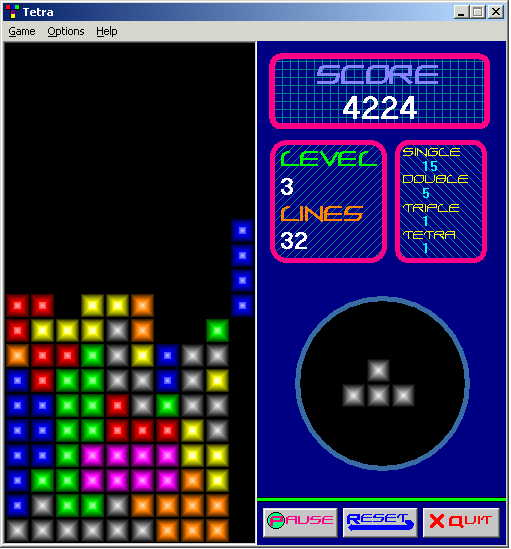



## Tetra

### Description

Tetra is a Tetris clone for Windows. I tried to make gameplay exactly the same as the NES and Gameboy Tetris, although there are some differences. There are 6 different types of music, 5 different types of blocks, and you can edit the key settings. Apart from how to make games, this code can teach you:

* toggle button (like in MS Paint)

* slider controls

* menu system

* SHELL command

* multimedia control

* timer controls

* file i/o

* use of resource file

* modules and classes

* and more...

All of the code is from scratch, with the exception of the BitmapBuffer class, which is based on code from Simon Price. The artwork is original, and the sounds and music, as well as the game font, are freeware. The readme has more info on that. Enjoy!

***Note*** This is a newer version. It re-creates the config file if it is missing, and also fixes a bug with blocks that extended above the ceiling.
 
### More Info
 
Make sure to retain the directory structure of the zip file. Also, install the Zerohour font on your computer so that the GUI looks like it should.

             |
---                |---
**Submitted On**   |2001-07-03 09:25:28
**By**             |[Seth Guenther](https://github.com/Planet-Source-Code/PSCIndex/blob/master/ByAuthor/seth-guenther.md)
**Level**          |Intermediate
**User Rating**    |4.7 (33 globes from 7 users)
**Compatibility**  |VB 6\.0
**Category**       |[Games](https://github.com/Planet-Source-Code/PSCIndex/blob/master/ByCategory/games__1-38.md)
**World**          |[Visual Basic](https://github.com/Planet-Source-Code/PSCIndex/blob/master/ByWorld/visual-basic.md)
**Archive File**   |[Tetra22137732001\.zip](https://github.com/Planet-Source-Code/seth-guenther-tetra__1-24658/archive/master.zip)

